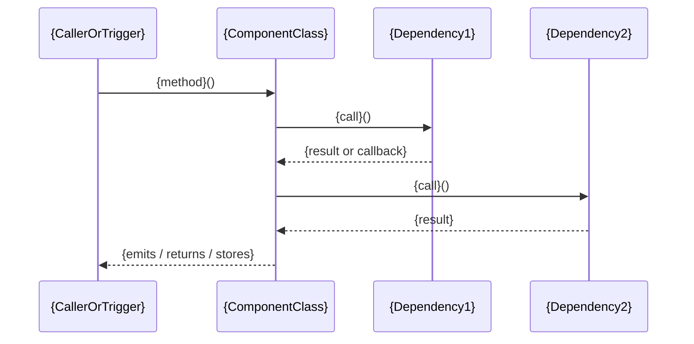

## Component System Design Document Format

> Author: Puras Handharmahua · 2026-06-19
> Related: developer-sysdesign-component-extract-worker.md (writer), developer-sysdesign-consolidate-worker.md (reader)

Single source of truth for the "Component System Design" document — written by `developer-sysdesign-component-extract-worker` (Step 6), parsed by `developer-sysdesign-consolidate-worker` (Step 1) to produce a Flow System Design.

---

## Schema

````markdown
# {ComponentName} — Component System Design

> Extracted from: {component_path}
> Platform: {platform}
> Date: {today}

---

## 1. Component Purpose

*{1–3 sentences describing what this component does and its role in the system.}*

**Architectural layer:** {e.g. Infrastructure / Domain Service / Data / Presentation Helper}

**Responsibilities:**
- {responsibility 1}
- {responsibility 2}

---

## 2. Public Interface

### Methods / Functions

| Method | Parameters | Returns | Description |
|---|---|---|---|
| `{methodName}` | `{param: Type}` | `{ReturnType}` | {what it does} |

### Properties / Streams

| Property | Type | Description |
|---|---|---|
| `{propertyName}` | `{Type}` | {what it represents} |

*(Mark streams/flows/publishers with their emission type, e.g. `Stream<LocationData>`.)*

---

## 3. Dependencies

| Dependency | Type | Role |
|---|---|---|
| `{ClassName}` | {Injected / Static / Native API / Package} | {what it provides} |

*(Injected = passed via constructor/init. Native API = platform SDK, e.g. CoreLocation, FirebaseMessaging. Package = third-party pub/pod/npm.)*

---

## 4. Data Model

### Produced Types

```
{TypeName}
  - {field}: {type}
  - {field}: {type}
```

*(Types this component creates or emits.)*

### Consumed Types

```
{TypeName}
  - {field}: {type}
```

*(Types this component accepts as input or reads.)*

---

## 5. High-Level Design

```
┌─────────────────────────────────────────────────┐
│  {LayerName}                                    │
│  {ComponentClass}                               │
│    exposes: {method1}, {method2}                │
│    emits: {Stream/Event/Callback}               │
└───────────┬──────────────────────┬──────────────┘
            │                      │
  ┌─────────▼──────────┐  ┌───────▼──────────────┐
  │  {Dependency1}     │  │  {Dependency2}        │
  │  {role}            │  │  {role}               │
  └────────────────────┘  └──────────────────────┘
```

---

## 6. Key Behaviors

*(One subsection per named behavior: initialization, primary flows, error handling, lifecycle events. Each behavior carries two blocks — the call trace, then the sequence diagram.)*

### {Behavior name — e.g. "Initialization", "Token Refresh", "Location Update"}

```
{Trigger or lifecycle event}
  → {ComponentClass}.{method}()
      → {Dependency}.{call}()
          ← {result or callback}
      → {emits / returns / stores}
  ← {caller receives or observes}
```

*(If a behavior is entirely internal with no external caller, note it as "Internal — no external trigger".)*

#### Sequence



*(For a behavior with no external caller, drop the `C` participant and start the diagram at the lifecycle event — use a `Note over K` to name the trigger.)*
````

---

## Sequence Diagram Rules

See `screen-system-design-format.md` §Sequence Diagram Rules — the same syntax, naming, and derive-never-re-trace rules apply here. Component-specific points:

- **Participants** are the component plus its traced dependencies from `## 3. Dependencies` — names must match that table exactly.
- **Native APIs and packages** (FirebaseMessaging, CoreLocation) are participants like any other; do not expand their internals.
- **Emissions** — a stream, callback, or delegate fired at the caller is a dashed return arrow (`-->>`) labelled with the emission type, e.g. `K-->>C: Stream<LocationData>`.
- **Lifecycle behaviors** with no caller start at the component itself.

---

## Section Contracts

| Section | Required | Written by | Read by | Purpose |
|---|---|---|---|---|
| Title + header metadata (component name, entry point, platform) | always | component-extract-worker | consolidate-worker (Step 1) | Source for the Flow doc's "Components in This Flow" table |
| `## 1. Component Purpose` | always | component-extract-worker | consolidate-worker | One-line summary per component, used in Flow "Participants" section |
| `## 2. Public Interface` | always | component-extract-worker | consolidate-worker | Method inventory — used to identify cross-participant contracts in the Flow design |
| `## 3. Dependencies` | always | component-extract-worker | consolidate-worker | Dependency graph — shared dependencies marked in Flow High-Level Design |
| `## 4. Data Model` | always | component-extract-worker | consolidate-worker | Types produced/consumed — merged into Flow unified data model |
| `## 5. High-Level Design` | always | component-extract-worker | consolidate-worker | Layer placement — combined into Flow High-Level Design |
| `## 6. Key Behaviors` → call trace | always | component-extract-worker | consolidate-worker | Flows used to identify cross-participant interactions for Flow design |
| `## 6. Key Behaviors` → `#### Sequence` | always | component-extract-worker | user (rendered) | Renderable view of the same behavior; must agree with the trace above it |
