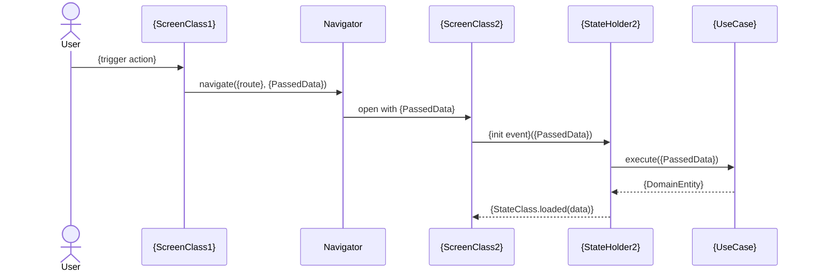
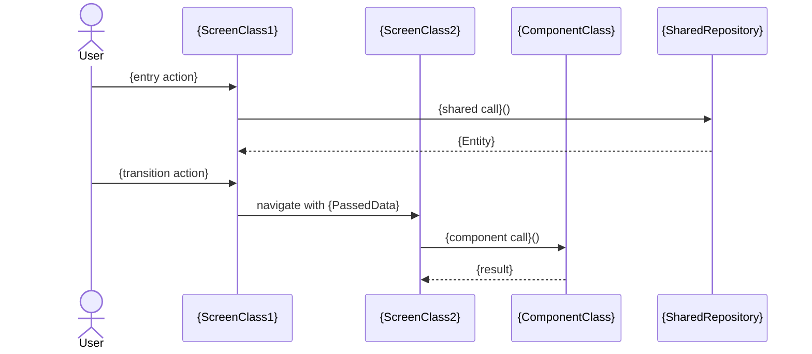

# Flow System Design Document Format

> Author: Puras Handharmahua · 2026-06-13
> Related: developer-sysdesign-consolidate-worker.md (writer)

Single source of truth for the "Flow System Design" document — written by `developer-sysdesign-consolidate-worker` (Step 4), consolidating multiple Screen System Design documents (see `screen-system-design-format.md`) into one. Currently terminal output surfaced to the user.

---

## Schema

````markdown
# {FlowName} — Flow System Design

> Screens: {comma-separated screen names}  
> Platform: {platform}  
> Date: {today}

---

## 1. Flow Overview

### Screens in This Flow

| Screen | Entry Point | Summary |
|---|---|---|
| {ScreenName} | `{entry_file}` | {one-line purpose from Feature Context} |

### User Journey

*{2–4 sentences describing how a user navigates through these screens and what they accomplish.}*

---

## 2. API Design (Unified)

### HTTP Endpoints

| Screen(s) | Method | Endpoint | Request | Response |
|---|---|---|---|---|
| {screen or "Shared"} | {method} | `{path}` | `{RequestDto or —}` | `{ResponseDto or —}` |

*(Mark endpoints used by more than one screen as "Shared".)*

### Real-time / WebSocket

{Combined WebSocket channels and event types across all screens. Write `None found.` if absent.}

---

## 3. Data Model (Unified)

### Data Inventory (Unified)

| Type | Kind | Participant(s) | Origin | Mapper | Consumed by |
|---|---|---|---|---|---|
| `{TypeName}` | {Entity \| DTO \| Request \| State model} | {Screen/Component names, or "Shared"} | `{METHOD /endpoint}`, `{LocalStore.key}`, or `↑ mapped from {DtoName}` | `{MapperName}` or `—` | `{UseCaseName}` / `{StateHolder}` / `{ComponentClass}` |

*(Merge of every participant's `### Data Inventory`. A type appearing in more than one design is marked `Shared` in the Participant(s) column and listed once. This table is the evidence for the Shared vs Participant-Specific split below — build it first, then group the field blocks from it.)*

### Shared Domain Entities

*(Entities referenced by more than one screen)*

```
{ClassName}
  - {field}: {type}
```

### Screen-Specific Entities

*(Entities unique to one screen)*

**{ScreenName}:**
```
{ClassName}
  - {field}: {type}
```

### Shared DTOs

```
{DtoName}
  - {field}: {type}
```

### Request / Input Types

*(All request/input types across screens)*

```
{InputClassName}  [{ScreenName}]
  - {field}: {type}
```

---

## 4. High-Level Design (Combined)

```
{ScreenName1}                      {ScreenName2}
┌──────────────────────┐           ┌──────────────────────┐
│ Presentation         │           │ Presentation         │
│ {ScreenClass1}       │           │ {ScreenClass2}       │
│ {BlocClass1}         │           │ {BlocClass2}         │
└──────────┬───────────┘           └──────────┬───────────┘
           │                                  │
           └────────────┬─────────────────────┘
                        │
        ┌───────────────▼──────────────────────┐
        │ Domain                               │
        │ {UseCase1}   {UseCase2}   {UseCase3} │
        │    └── {SharedRepositoryInterface}   │
        └───────────────┬──────────────────────┘
                        │
        ┌───────────────▼──────────────────────┐
        │ Data                                 │
        │ {SharedRepositoryImpl}               │
        │   → {RemoteDataSource}               │
        │   → {LocalDataSource}                │
        └──────────────────────────────────────┘
```

*(Adapt diagram to the actual number of screens and shared/separate components found.)*

---

## 5. Cross-Screen Data Flow

*(One subsection per transition. Skip if screens are independent with no shared state. Each transition carries two blocks — the call trace, then the sequence diagram.)*

### {ScreenName1} → {ScreenName2}

```
{TriggerAction in Screen1}
  → navigate to {ScreenName2} with {PassedData}
      → {ScreenName2} initializes {UseCase} with {PassedData}
```

*{Describe what data or context is passed between screens and how it is used.}*

#### Sequence



### End-to-End Sequence

*(One diagram for the whole flow, spanning every participant. Include only if the flow has three or more participants — otherwise the per-transition diagrams above already cover it.)*



---

## 6. Screen Index

| Screen | System Design File | Entry Point |
|---|---|---|
| {ScreenName} | [{filename}]({relative path}) | `{entry_file}` |
````

---

## Sequence Diagram Rules

See `screen-system-design-format.md` §Sequence Diagram Rules — the same syntax, naming, and derive-never-re-trace rules apply here. Flow-specific points:

- **Participants** must reuse the exact class names from each participant design's own diagrams. Never rename a class when merging.
- **Navigator** is a participant whenever a transition crosses screens; label the arrow with the route and the data passed.
- **Components** appear as participants alongside screens — a flow bundle mixes both.
- **End-to-End Sequence** is a summary, not a concatenation. Collapse each participant's internal layers (use case → repository → data source) to the single call that matters at flow level.

---

## Section Contracts

| Section | Required | Written by | Read by | Purpose |
|---|---|---|---|---|
| Header metadata (`> Screens:`, `> Platform:`, `> Date:`) | always | consolidate-worker | user | Identifies which screens and platform the flow covers, and when it was generated |
| `## 1. Flow Overview` | always | consolidate-worker | user | Summarizes the screens involved and the end-to-end user journey through the flow |
| `## 2. API Design (Unified)` | always | consolidate-worker | user | Deduplicated endpoint inventory across the flow, with shared endpoints flagged |
| `## 3. Data Model (Unified)` → `### Data Inventory (Unified)` | always | consolidate-worker | user | Merged type-to-origin bindings across all participants; the evidence for the shared vs specific split below |
| `## 3. Data Model (Unified)` → field blocks | always | consolidate-worker | user | Shows which entities/DTOs are shared vs screen-specific, clarifying coupling |
| `## 4. High-Level Design (Combined)` | always | consolidate-worker | user | Single layer diagram showing how screens connect through shared domain/data components |
| `## 5. Cross-Screen Data Flow` → call trace | always | consolidate-worker | user | Documents navigation transitions and data passed between screens |
| `## 5. Cross-Screen Data Flow` → `#### Sequence` | always | consolidate-worker | user (rendered) | Renderable view of each transition; must agree with the trace above it |
| `## 5. Cross-Screen Data Flow` → `### End-to-End Sequence` | if ≥3 participants | consolidate-worker | user (rendered) | Single whole-flow diagram with each participant's internals collapsed |
| `## 6. Screen Index` | always | consolidate-worker | user | Quick links from the flow doc back to each screen's individual system design |
