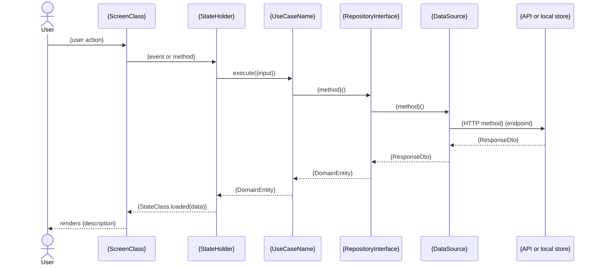

# Screen System Design Document Format

> Author: Puras Handharmahua · 2026-06-13
> Related: developer-sysdesign-extract-worker.md (writer), developer-sysdesign-consolidate-worker.md (reader)

Single source of truth for the "Screen System Design" document — written by `developer-sysdesign-extract-worker` (Step 5), parsed by `developer-sysdesign-consolidate-worker` (Step 1) to produce a Flow System Design.

---

## Schema

````markdown
# {ScreenName} — Screen System Design

> Extracted from: {screen_path}  
> Platform: {platform}  
> Date: {today}

---

## 1. Feature Context

*{1–3 sentences describing what this screen does, inferred from UseCase names and class purpose.}*

**UseCases in scope:**
- `{UseCaseName}` — {one-line purpose inferred from method name and types}
- ...

---

## 2. API Design

### HTTP Endpoints

| Method | Endpoint | Request Body | Response |
|---|---|---|---|
| {method} | `{path}` | `{RequestDto or —}` | `{ResponseDto or —}` |

*(Add rows for each endpoint found in DataSource files. Mark as `(stub)` if the implementation is mocked.)*

### Real-time / WebSocket

{Describe WebSocket channels, event types, and payload structure if found. Write `None found.` if absent.}

---

## 3. Data Model

### Data Inventory

| Type | Kind | Origin | Mapper | Consumed by | Surfaced as |
|---|---|---|---|---|---|
| `{TypeName}` | {Entity \| DTO \| Request \| State model} | `{METHOD /endpoint}`, `{LocalStore.key}`, or `↑ mapped from {DtoName}` | `{MapperName}` or `—` | `{UseCaseName}` or `{StateHolder}` | `{state.field}` or `—` |

*(One row per data type the screen touches — every entity, DTO, request/input type, and state model, including types the screen only reads in passing. The field blocks below carry each type's **shape**; this table carries the **relationships**: which DTO becomes which entity, through which mapper, from which endpoint, and where it lands in state.)*

**Screens handling more than one data set.** A screen commonly loads several unrelated types — e.g. a form config, an employee quota, and a user profile. Every one of them gets a row. Order rows by data set and keep each set's `DTO → Entity → state` rows adjacent, so the chain for each set reads top-to-bottom. Do not collapse or omit a type because it is secondary to the screen's main purpose.

### Domain Entities

```
{ClassName}
  - {field}: {type}
  - {field}: {type}
```

*(One block per domain entity. Omit persistence annotations.)*

### DTOs

```
{DtoName}
  - {field}: {type}    // "{json_key}" if different
```

*(One block per DTO. Note JSON key name if it differs from field name.)*

### Request / Input Types

```
{InputClassName}
  - {field}: {type}
```

*(UseCase inputs, form state, request params.)*

---

## 4. High-Level Design

```
┌─────────────────────────────────────────────────┐
│  Presentation ({platform})                      │
│  {ScreenClass}                                  │
│  {StateHolder}  (Bloc/Cubit, ViewModel, Presenter, Store) │
│    state: {State1}, {State2}                    │
│    inputs: {Event1}, {Event2}  (events/actions/methods) │
└────────────────────┬────────────────────────────┘
                     │
┌────────────────────▼────────────────────────────┐
│  Domain                                         │
│  {UseCase1} → {RepositoryInterface}             │
│  {UseCase2} → {RepositoryInterface}             │
└────────────────────┬────────────────────────────┘
                     │
┌────────────────────▼────────────────────────────┐
│  Data                                           │
│  {RepositoryImpl}                               │
│    → {RemoteDataSource}    [{API client}]       │
│    → {LocalDataSource}     [{local store}]      │
│  Mappers: {Mapper1}, {Mapper2}                  │
└─────────────────────────────────────────────────┘
```

---

## 5. Data Flow

*(One subsection per named flow. Name flows after the user action or trigger. Each flow carries two blocks — the call trace, then the sequence diagram.)*

### {Flow name — e.g. "Load {ScreenName}", "Submit {FormName}", "Observe {ResourceName}"}

```
{UserAction or Trigger}
  → {ScreenClass}.{method}()
      → {BlocClass / VM}.{event or method}
          → {UseCaseName}.execute({input})
              → {RepositoryInterface}.{method}()
                  → {DataSource}.{method}()
                      → {HTTP method} {endpoint}
                  ← {ResponseDto}
              ← {DomainEntity}
          ← {StateClass.loaded(data)}
      ← UI renders {description}
```

*(If a flow is entirely local — no API call — end the trace at the local data source.)*

#### Sequence



---

## 6. UI Stack

### State Model

| State / Property | Type | Meaning |
|---|---|---|
| `{StateName}` | `{type}` | {what it represents} |

*(For union/sealed state — e.g. `Loading` / `Loaded(data)` / `Error(message)` — list each variant as its own row with the fields it carries.)*

### Component Hierarchy

```
{ScreenClass}
  ├── {ChildComponent1}  ← {state condition that shows it}
  ├── {ChildComponent2}
  └── {ChildComponent3}
```

*(Component = Flutter Widget, iOS View/Subview, Android View/Composable, Web JSX element. Hierarchy reflects the screen's render/layout structure — `build()` (Flutter), `body` (iOS/SwiftUI), Fragment+layout (Android), or JSX tree (Web).)*

**Complex hierarchies** — extend the basic tree with these patterns as needed:

```
{ScreenClass}
  ├── {LoadingComponent}        ← state is Loading
  ├── {ErrorComponent}          ← state is Error
  └── {ContentComponent}        ← state is Loaded
        ├── {HeaderComponent}
        ├── {ListComponent}
        │     └── {ItemComponent} × N   ← repeated per item in {state.items}
        ├── {ChildStateHolder}          ← independent state, scoped to this subtree
        │     └── {SectionComponent}
        └── {ModalComponent}            ← overlay shown when {state.flag} is true
```

- **Conditional branches** — one branch per state variant (Loading/Error/Loaded, etc.)
- **Repeated components** — mark with `× N` and name the source list in state
- **Nested StateHolders** — note where a child component manages its own state independently of the screen's StateHolder
- **Overlays/modals** — list separately from the main tree, with the state condition that triggers them

### User Interactions

| Interaction | Triggers | Effect |
|---|---|---|
| {e.g. "Tap submit button"} | `{EventName}` | {visible result} |
| {e.g. "Tap item in list"} | `{EventName}({itemId})` | {navigation/effect} |
| {e.g. "Pull to refresh"} | `{EventName}` | {state transitions back to Loading} |
````

---

## Sequence Diagram Rules

These apply wherever a `mermaid sequenceDiagram` block appears in this repo's system design formats — screen `## 5`, component `## 6`, flow `## 5`.

**Derive, never re-trace.** The diagram is a rendering of the call trace directly above it, not a second pass over the source. Write the trace first, then transcribe it. The two blocks must name the same classes, the same methods, and the same endpoints — a class in one and not the other is a defect.

**Syntax:**

| Rule | Form |
|---|---|
| Participants | One `participant {alias} as {ClassName}` per class, declared up front, in call order |
| Aliases | Short and stable — `S` screen, `SH` state holder, `UC` use case, `R` repository, `DS` data source, `API` remote |
| User | `actor U as User` — only when a user action starts the flow; omit for lifecycle or push-driven flows |
| Calls | `->>` solid arrow |
| Returns | `-->>` dashed arrow |
| Branches | `alt` / `else` / `end` — only for branches evidenced in source (cache hit vs miss, error path) |
| Optional steps | `opt` / `end` |
| Repetition | `loop` / `end` — retries, pagination, polling |
| Concurrency | `par` / `and` / `end` — when a state holder fires several use cases without awaiting in sequence |

**Naming.** Participant names must match the class names used in `## 4. High-Level Design` exactly. Never abbreviate the `as` label; abbreviate only the alias.

**Scope.** No styling directives, no `autonumber`, no `Note` unless a step needs a caveat that the arrow label cannot carry. If a flow is entirely local, omit the `API` participant and end at the local data source.

**Multi-data screens.** When one flow loads several independent types, use `par` / `and` for calls the state holder issues concurrently, and keep each branch's participants distinct. Do not merge unrelated data sets into one arrow.

---

## Section Contracts

| Section | Required | Written by | Read by | Purpose |
|---|---|---|---|---|
| Title + header metadata (screen name, entry point, platform) | always | extract-worker | consolidate-worker (Step 1) | Source for the Flow doc's "Screens in This Flow" table and Screen Index |
| `## 1. Feature Context` | always | extract-worker | consolidate-worker | One-line summary per screen, used in Flow "Screens in This Flow" |
| `## 2. API Design` | always | extract-worker | consolidate-worker | Endpoint inventory — merged/deduped into Flow `## 2. API Design (Unified)`, shared endpoints marked |
| `## 3. Data Model` → `### Data Inventory` | always | extract-worker | consolidate-worker | Type-to-origin-to-state bindings — the authoritative list of every type the screen touches; drives the Shared vs Screen-Specific split in Flow `## 3` |
| `## 3. Data Model` → field blocks | always | extract-worker | consolidate-worker | Entity/DTO/request field shapes — re-emitted under the matching group in Flow `## 3. Data Model (Unified)` |
| `## 4. High-Level Design` | always | extract-worker | consolidate-worker | Per-screen layer diagram — combined into Flow `## 4. High-Level Design (Combined)` |
| `## 5. Data Flow` → call trace | always | extract-worker | consolidate-worker | Named flows — used to identify cross-screen transitions for Flow `## 5. Cross-Screen Data Flow` |
| `## 5. Data Flow` → `#### Sequence` | always | extract-worker | user (rendered) | Renderable view of the same flow for sharing in Confluence/GitHub; must agree with the trace above it |
| `## 6. UI Stack` | always | extract-worker | consolidate-worker | Read for context; not directly re-emitted in the Flow design |
